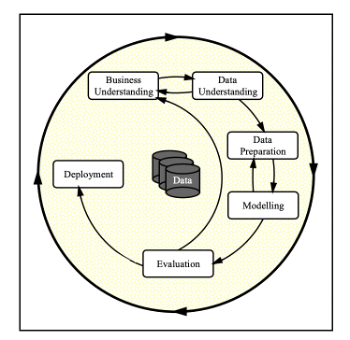
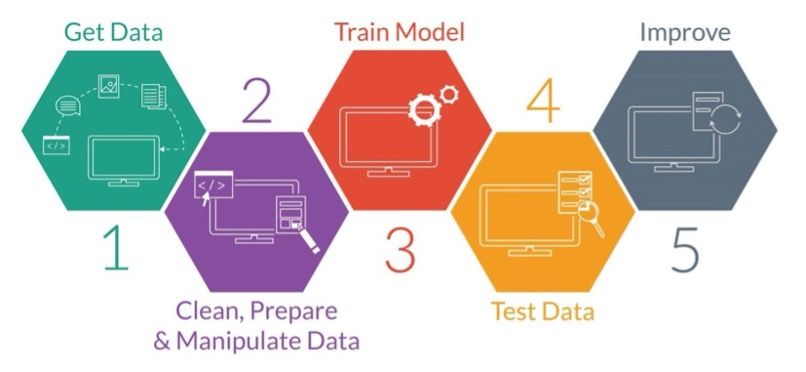
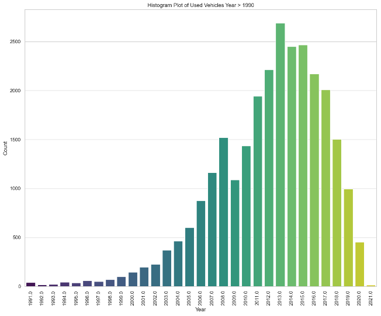

## Practical Application 2 - Assignment 11.1: What Drives the Price of a Car?

## Contents
- [Introduction](#introduction)
- [How to Use the Files in This Repository](#how-to-use-the-files-in-this-repository)
- [Project Overview](#project-overview)
- [Business Understanding](#business-understanding)
- [Data Understanding](#data-understanding)
- [Data Preparation](#data-preparation)
- [Regression Models](#regression-models)
- [Findings](#findings)
- [Next Steps and Recommendations](#next-steps-and-recommendations)

---

## Introduction

This repository contains the Jupyter Notebook for Practical Application Assignment 11.1. The project involves analyzing a Kaggle dataset of used car sales (vehicles.csv) to build a machine learning model that predicts used car prices based on vehicle features like fuel type, condition, size, type, color, and more.

By evaluating how these features affect car prices, the model can help car dealerships and sales teams understand which vehicles to stock based on consumer preferences, thereby optimizing inventory and increasing sales.

---

## How to Use the Files in This Repository

The repository is organized into the following directories and files:

- **data**: Contains the `vehicles.csv` dataset from Kaggle, used for training the machine learning model.
- **images**: Stores image files used in the Jupyter Notebook and the project documentation.
- **notebooks**: Contains the Jupyter Notebook titled **What Drives the Price of a Car?**, which performs the data analysis and builds the machine learning model.

### To use the files:
1. Clone or download the repository.
2. Open the Jupyter Notebook (**What Drives the Price of a Car?**).
3. Run the cells sequentially to analyze the data, build the model, and view the results.

Ensure that you have the necessary libraries installed, such as:
- `pandas`
- `numpy`
- `matplotlib`
- `scikit-learn`

---

## Project Overview

The project follows a structured machine learning process that aligns with both the **CRISP-DM (Cross-Industry Standard Process for Data Mining)** methodology and the **5 Core Machine Learning Steps**. The process includes:

1. **Data Collection**: Gathering relevant data on used vehicles (Step 1 of CRISP-DM).
2. **Data Cleaning & Preparation**: Cleaning the dataset by handling missing values, removing unrealistic data, and preparing it for analysis (Step 2 of CRISP-DM).
3. **Feature Selection & Engineering**: Identifying the most significant features that impact vehicle prices (Step 3 of CRISP-DM).
4. **Model Training**: Using machine learning algorithms to train the model based on the prepared data (Step 4 of CRISP-DM and the 5 Core ML Steps).
5. **Model Evaluation**: Testing and evaluating the model's performance by measuring prediction accuracy (Step 5 of CRISP-DM and the 5 Core ML Steps).

As part of the model lifecycle, we recommend continuously gathering and incorporating additional sales data to improve the model's performance over time, ensuring it evolves to reflect changing consumer preferences.

**Source:** 
- CRISP-DM: Towards a Standard Process Model for Data Mining by Rüdiger Wirth and Jochen Hipp
- [5 Core Machine Learning Steps](https://centricconsulting.com/blog/machine-learning-a-quick-introduction-and-five-core-steps/).

## Business Understanding

The primary business objective of this project is to identify the key factors that influence the price of used cars. By understanding these factors, car dealerships can adjust their inventory to feature the cars that consumers are most interested in, thus increasing sales and revenue.

**Background:**

From a business perspective, we are tasked with identifying key drivers for used car prices.

**Business objective:**

In this practical application “What drives the price of a car?” our goal is to develop a model to understand the factors influencing the price of used cars. 

We need to identify, analyze and try to quantify the relationships between car attributes and their market price for the benefit of the stake holders (car dealership and consumers). This involves analyzing the dataset to uncover patterns, correlations, and trends that affect pricing, with the ultimate objective of constructing a regression model to predict car prices based on these factors.

**For this project the success criteria would be:**

Car dealerships needs to understand
- which car attributes (e.g., make, model, age, mileage, color) most significantly affect pricing, to make informed decisions about which cars to stock
- the key drivers to better negotiate prices with customers, decide which deals to offer, and identify the cars that are in high demand to keep in stock

**Assess Situation:**

For this analysis, we have been provided with a vehicle dataset containing 426k cars. The main challenge here is that the dataset may contain outliers and missing values, which could skew our analysis or reduce the quality of the model. Removing or imputing missing data and handling outliers will be critical steps to ensure the dataset is usable and robust for training and testing predictive models.

**Data mining goals:**

We will primarily use regression modeling to identify and quantify the factors that most influence the price of used cars. We will focus on understanding the relationship between independent variables (like make, model, year, mileage, condition, etc.) and the dependent variable (price).

## Data Understanding

As part of the Data Understanding, we will look into the initial data collected, Describe the data, Explore the data and verify the quality of the collected data.

**Verify the data quality:**

We need to validate the quality of data by checking are the data generally accurate, or are there systemic issues like repeated errors in certain columns? Are there many missing or inconsistent values? How should they be handled? Are there any columns with high redundancy or irrelevant information? This will help us to prepare the data.

The initial observation from the provided data was that it was not clean. It contained missing values, and several entries appeared unrealistic for used cars, such as odometer readings with zero or single-digit values and prices listed as zero or single digits.

## Data Preparation

The data preparation process involved several key steps:
- Removing records with zero values for Price and Odometer.
- Eliminating entries where key features were missing or not populated.
- Converted categorical variables into dummy/indicator variables using OneHotEncoder/get_dummies 
- Dropping irrelevant factors (VIN, ID, region) that do not significantly influence vehicle pricing.
- Reviewing other features (state, paint color, manufacturer, transmission) to assess their impact on price, and removing those with little influence based on the data.
- Filtering the data to include only vehicles manufactured in 1990 or later, as the dataset contained very few records for vehicles manufactured before 1990.

## Regression Models

We tested a total of 9 machine learning models, including 7 linear regression models, and 1 each of Ridge and Polynomial regression. These models were built using the full set of features after data manipulation, as well as a subset of features selected based on the correlation between each feature and used car prices.

In addition, some models incorporated further filtering (e.g., **Price** and **Odometer > 5000**, **Year > 1990**) to refine the datasets used for training.

For the Linear models, accuracy was below 50%, while the Ridge model scored above 55%. 

The current accuracy scores indicate that there is still progress to be made in achieving a higher-performing model, with the highest accuracy for both training and testing data hovering around 55%. Interestingly, the model with the highest accuracy (55.66% for training and 56.14% for testing) aligns with the features that show the strongest correlation to price in the correlation matrix.

## Findings

The quality of the provided data is suboptimal, with several missing values and unrealistic entries. For example, $0 for price and 0 for the odometer reading are present. These values are not possible for used cars in real world. Attempting to replace these unrealistic or incorrect values using standardization or normalization techniques (like mean or median) for variables like price and odometer readings proved not much useful.

Looking at various vehicle-specific features present (like Fuel, Condition, Size, Type, Color), more context would be needed to replace the missing or unrealistic values appropriately. To perform a more accurate and realistic data preparation process, these additional features would need to be considered.

I tried using OneHotEncoder and get_dummies methods. Then we saw the linear model complexity that minimized the test error value of 2 is similar to or identical to some of the previous model applications. This suggests that there is little to no difference between using OneHotEncoder and get_dummies for converting categorical variables into dummy/indicator variables.

As a result of these issues, I chose to remove the problematic records from the dataset. Additionally, we eliminated features such as ID, VIN, State, Manufacturer, and Model, as we did not believe they significantly impacted used car prices, more importantly for the given dataset.

The `ML Application model` with all the final dataset after data manipulation returned: 

`Sixth_Model` Features selected: odometer, year, fuel_diesel, drive_4wd, and size_full-size, based on their correlation with price for vehicles with odometer > 5000 and price > 5000 returned:

`Seventh_Model and Linear Model` Features selected: odometer, year, fuel_diesel, drive_4wd, and size_full-size, filtered by odometer > 5000, price > 5000, and year > 1990 returned:

`Ridge_Model` Features selected: odometer, year, fuel_diesel, drive_4wd, and size_full-size, filtered by odometer > 5000, price > 5000, and year > 1990 returned:

**Comparison of price returned by the models shown below:**

Model built using the full dataset (including features like Odometer, Year, Condition, Fuel Type, Drive Train, and Size) yielded unrealistic results:
- Predicted price for a new car with 100 miles, excellent condition, diesel engine, and 4WD: -98,263.87 
- Predicted price for a new car with 100 miles, good condition, electric engine, and front-wheel drive: 29,013.33.

Seventh_Model and Linear Model predictions for a 2020 vehicle with 10K miles:
- Diesel fuel, 4WD, and full size: Predicted price: 48,238.
- No diesel fuel, 4WD, and full size: Predicted price: 31,700.

Ridge Model predictions for a 2020 vehicle with 10K miles:
- Diesel fuel, 4WD, and full size: Predicted price: 51,629.
- No diesel fuel, 4WD, and full size: Predicted price: 34,974.

In conclusion, **ridge regression** appears to be the best model for this dataset, as it achieves the highest accuracy and relatively moderate RMSE. Seventh_model or Linear model could be a good alternative if we are concerned about overfitting, but linear regression might not be sufficient for capturing the underlying patterns.

## Next Steps and Recommendations

While the current model (Ridge regression model) is ready for deployment, we recommend gathering additional high-quality data to build a model with an accuracy of 75% or higher. This model should be trained on used vehicle data no older than 10 years.

The provided data is not fully clean, containing null values, NaNs, zeros, missing data, and unrealistic entries. Further filtering could help improve the dataset, such as by selecting used vehicle records with a manufacturing year of 2000 or later. This approach would allow the model to focus on newer vehicle features, such as model, cylinders, drive type, and size, which are more likely to influence the prices of newer used cars with lower odometer readings. This could also potentially lead to improved model accuracy of the model. 

Additionally, more comprehensive and higher-quality data should be collected to enhance the model. This data could include newer features of used cars, such as automated driving safety features, infotainment systems, cameras, remote start, and car mileage, all of which can impact used car prices.

Additional Data on used car datasets [Kaggle Used Cars Datasets](https://www.kaggle.com/search?q=used+cars)

